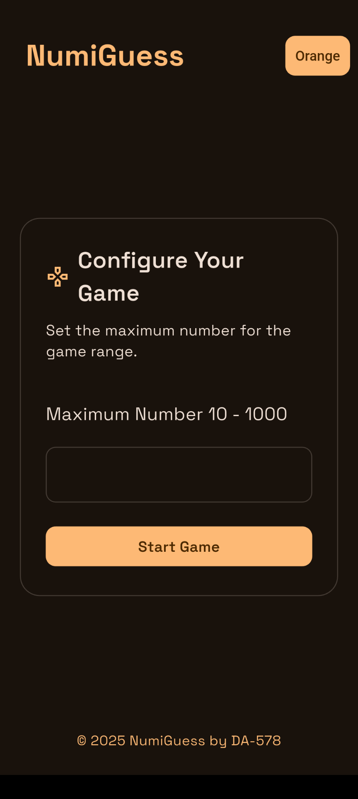
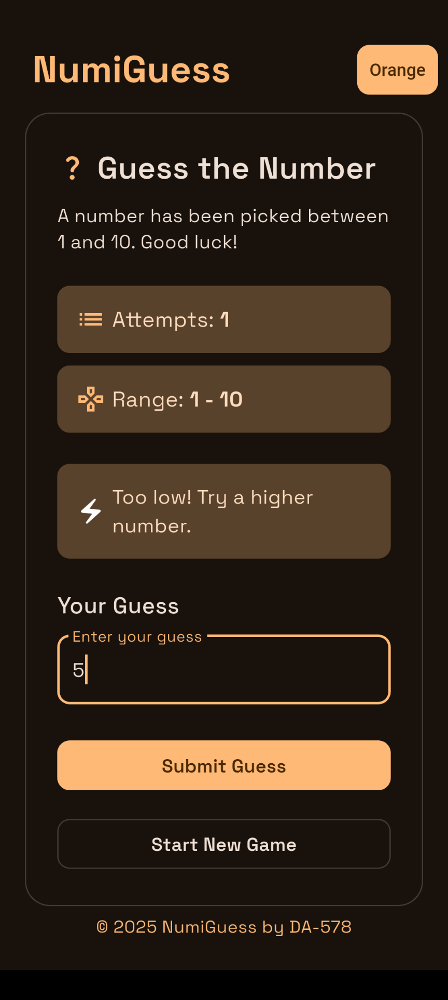
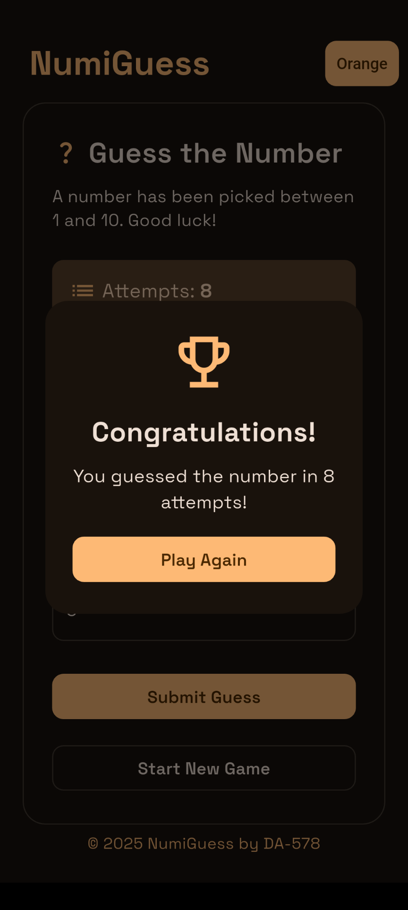

<div align="center">

<h1 style="margin-bottom: 5px;">NumiGuess – Number Guessing Game</h1>
<div style="margin-bottom: 10px;">
    
    
    
</div>
</div>

NumiGuess is a simple mobile and desktop number guessing game built with [Flutter](https://flutter.dev). Challenge yourself to guess the hidden number in the fewest attempts possible!

## 📱 App Preview





## 🧠 Features

- ✅ Simple and intuitive user interface  
- 🔢 Guess a number within a specific range (e.g., 1–100)  
- 🎯 Get hints when your guess is wrong (higher or lower)  
- 🏆 See how many attempts it took you to win  
- 🔄 "Reset" button to start a new game  

## 📦 Installation

Make sure you have the Flutter SDK installed. Then follow these steps depending on your target platform.

### Prerequisites

- [Flutter SDK](https://flutter.dev/docs/get-started/install)
- Git
- IDE (Android Studio, VS Code, etc.)

### For Web

To run the app on the web:

```bash
flutter build web
```

Then open the `build/web` folder using a local server or deploy it to your hosting platform.

---

### For Android

1. Connect your Android device or use an emulator.
2. Run the app:

```bash
flutter build apk
flutter install
```

Or directly run:

```bash
flutter run --release
```

### For Windows

1. Enable Windows desktop support:

```bash
flutter config --enable-windows-desktop
```

2. Build the app:

```bash
flutter build windows
```

You can find the executable inside the `build/windows` folder.

### For Linux

1. Enable Linux desktop support:

```bash
flutter config --enable-linux-desktop
```

2. Build the app:

```bash
flutter build linux
```

The executable will be located in the `build/linux` folder.

## 📜 License

This project is licensed under the MIT License. See the [LICENSE](LICENSE) file for more details.